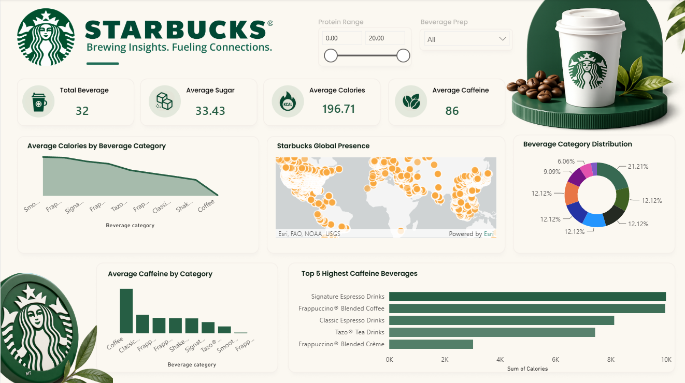

# ☕ Starbucks Nutrition Analytics

An end-to-end **data analytics and machine learning project** analyzing Starbucks beverage nutritional data using **SQL, Python, Exploratory Data Analysis (EDA), K-Means Clustering, and Power BI**.

The project focuses on understanding nutritional patterns across beverages and segmenting drinks based on their nutritional characteristics.

---

## 📌 Project Objective

The objective of this project is to transform raw Starbucks nutritional data into meaningful insights.

This project answers questions such as:

- Which beverage categories have the highest average calories?
- Which beverages contain the highest sugar, protein, and caffeine?
- What is the relationship between calories and other nutritional attributes?
- Is sugar strongly associated with calorie content?
- Can beverages be grouped into meaningful nutritional segments using machine learning?
- Which beverage groups represent high-sugar, high-protein, low-calorie, or indulgent options?

---

## 🎯 Project Motto

> **Transform raw Starbucks nutritional data into actionable insights and identify meaningful beverage segments using data analytics and machine learning.**

---

## 🛠️ Technologies Used

| Technology | Purpose |
|---|---|
| SQL | Data querying and analysis |
| Python | Data cleaning and analysis |
| Pandas | Data manipulation |
| NumPy | Numerical operations |
| Matplotlib | Data visualization |
| Scikit-learn | Machine learning and K-Means clustering |
| Power BI | Interactive dashboard and business visualization |

---


## 📂 Dataset Features

The dataset contains Starbucks beverage information along with nutritional attributes such as:

- Beverage Category
- Beverage
- Beverage Preparation
- Calories
- Total Fat
- Trans Fat
- Saturated Fat
- Sodium
- Total Carbohydrates
- Cholesterol
- Dietary Fibre
- Sugars
- Protein
- Vitamin A
- Vitamin C
- Calcium
- Iron
- Caffeine

---
## 📊 Power BI Dashboard

The Power BI dashboard provides an interactive overview of Starbucks beverage nutritional data and visualizes key insights from the analysis.

### Dashboard Preview



### Dashboard Highlights

- Total Beverage Count
- Average Calories
- Average Sugar
- Average Caffeine
- Beverage Category Distribution
- Average Calories by Beverage Category
- Average Caffeine by Beverage Category
- Top 5 Highest-Calorie Beverages
- Protein Range Filter
- Beverage Preparation Filter

- 
## 🔄 Project Workflow

```text
Raw Starbucks Dataset
        ↓
SQL Analysis
        ↓
Python Data Cleaning
        ↓
Exploratory Data Analysis
        ↓
Distribution Analysis
        ↓
Category-Wise Nutritional Analysis
        ↓
Correlation Analysis
        ↓
Feature Selection
        ↓
StandardScaler
        ↓
Elbow Method
        ↓
K-Means Clustering
        ↓
Cluster Profiling
        ↓
Power BI Dashboard
        ↓
Business Insights
```

---

# 🧹 Data Cleaning

The dataset required preprocessing before analysis and machine learning.

The following preprocessing steps were performed:

- Removed unnecessary spaces from column names
- Checked for missing values
- Checked for duplicate records
- Converted numerical values stored as text into numeric values
- Removed `%` symbols from vitamin columns
- Converted invalid caffeine values such as `Varies` into missing values
- Handled missing values using category-level median values
- Prepared clean numerical features for clustering

### Example

```python
df.columns = df.columns.str.strip()
```

This ensures that columns such as:

```text
 Total Fat (g)
 Protein (g)
```

are converted into:

```text
Total Fat (g)
Protein (g)
```

---

# 📊 Exploratory Data Analysis

Exploratory Data Analysis (EDA) was performed before applying machine learning to understand the dataset and identify important patterns.

The following analyses were performed:

- Descriptive statistics
- Distribution analysis
- Histograms
- Boxplots
- Outlier analysis
- Beverage category comparison
- Correlation analysis
- Calories vs. Sugars analysis
- Calories vs. Caffeine analysis

---

## 🔢 Key Numerical Insights

The dataset contains **242 beverage records**.

| Metric | Maximum Value |
|---|---:|
| Calories | 510 |
| Sugars | 84 g |
| Protein | 20 g |
| Caffeine | 410 mg |

The data shows significant variation across beverages, making it suitable for nutritional segmentation.

---

# 📈 Category-Wise Analysis

The average nutritional profile was analyzed across Starbucks beverage categories.

### Important Findings

- **Smoothies** had the highest average protein at approximately **17.11 g**
- **Frappuccino® Blended Coffee** had the highest average sugar at approximately **57.08 g**
- **Coffee** had the highest average caffeine at approximately **293.75 mg**
- **Coffee** had very low average calories at approximately **4.25 calories**
- Higher-calorie beverages generally showed higher average sugar and carbohydrate levels

---

# 🔗 Correlation Analysis

A correlation matrix was created using the following features:

- Calories
- Total Fat
- Total Carbohydrates
- Sugars
- Protein
- Caffeine

## Important Correlations

| Feature Relationship | Correlation |
|---|---:|
| Calories vs. Sugars | **0.91** |
| Calories vs. Total Carbohydrates | **0.80** |
| Total Carbohydrates vs. Sugars | **0.77** |
| Calories vs. Total Fat | **0.63** |
| Calories vs. Protein | **0.58** |
| Calories vs. Caffeine | **-0.03** |

### Key Insight

The strongest relationship was observed between **Calories and Sugars**, with a correlation of **0.91**.

This indicates a strong positive linear association between sugar and calorie content in the beverages analyzed.

Caffeine showed almost no linear relationship with calories, with a correlation of **-0.03**. This suggests that a beverage can have high caffeine content without necessarily having high calorie content.

> **Note:** Correlation indicates association, not causation.

---

# 🤖 Machine Learning: K-Means Clustering

Since the dataset does not contain a target variable to predict, this problem was treated as an **unsupervised learning problem**.

K-Means clustering was used to group beverages with similar nutritional characteristics.

## Features Used for Clustering

```python
clustering_features = [
    'Calories',
    'Total Fat (g)',
    'Total Carbohydrates (g)',
    'Sugars (g)',
    'Protein (g)',
    'Caffeine (mg)'
]

X = df[clustering_features]
```

These features provide a nutritional profile for every beverage.

---

# ⚖️ Feature Scaling

Before applying K-Means, the data was standardized using `StandardScaler`.

```python
from sklearn.preprocessing import StandardScaler

scaler = StandardScaler()
X_scaled = scaler.fit_transform(X)
```

Feature scaling was necessary because the variables had significantly different ranges.

For example:

```text
Calories  → up to 510
Caffeine  → up to 410
Sugars    → up to 84
Protein   → up to 20
```

K-Means uses distance calculations. Without scaling, features with larger numerical ranges could disproportionately influence the clustering process.

`StandardScaler` transforms each feature approximately using:

```text
z = (x - mean) / standard deviation
```

After scaling, each feature has approximately:

```text
Mean = 0
Standard Deviation = 1
```

---

# 📉 Elbow Method

The Elbow Method was used to determine a suitable number of clusters.

Different values of **K from 2 to 10** were tested.

```python
from sklearn.cluster import KMeans

wcss = []

for k in range(2, 11):
    kmeans = KMeans(
        n_clusters=k,
        random_state=42,
        n_init=10
    )

    kmeans.fit(X_scaled)
    wcss.append(kmeans.inertia_)
```

The `inertia_` value represents the **Within-Cluster Sum of Squares (WCSS)**.

As the number of clusters increases, WCSS decreases. The preferred value of K is selected near the point where adding additional clusters provides diminishing improvement.

Based on the Elbow Method, **K = 5 was selected for the final segmentation**.

---

# 🎯 Final K-Means Model

```python
kmeans = KMeans(
    n_clusters=5,
    random_state=42,
    n_init=10
)

df['Cluster'] = kmeans.fit_predict(X_scaled)
```

Each beverage was assigned to one of five clusters based on its nutritional characteristics.

---

# 🧩 Cluster Results

| Cluster | Calories | Sugars | Protein | Caffeine | Number of Beverages |
|---|---:|---:|---:|---:|---:|
| 0 | 220.00 | 46.34 g | 3.83 g | 60.74 mg | 47 |
| 1 | 130.13 | 19.88 g | 6.22 g | 59.90 mg | 78 |
| 2 | 253.62 | 35.33 g | 12.83 g | 93.58 mg | 58 |
| 3 | 66.97 | 14.15 g | 1.26 g | 147.35 mg | 34 |
| 4 | 377.60 | 68.72 g | 9.48 g | 129.20 mg | 25 |

---

# 🏷️ Cluster Interpretation

## Cluster 0 — High-Sugar Beverages

- Moderate-to-high calories
- High sugar content
- Lower protein
- Moderate caffeine

**Interpretation:** Sweet beverages with relatively high sugar content.

---

## Cluster 1 — Moderate Nutrition

- Moderate calories
- Moderate sugar
- Moderate protein
- Lower caffeine

**Interpretation:** Beverages with relatively balanced nutritional characteristics.

---

## Cluster 2 — High-Protein Beverages

- Higher calories
- Highest protein among the clusters
- Moderate sugar
- Moderate caffeine

**Interpretation:** Nutritionally denser beverages that may appeal to consumers looking for higher protein intake.

---

## Cluster 3 — Low-Calorie, High-Caffeine Beverages

- Lowest calorie levels
- Low sugar
- Low protein
- Highest relative caffeine among the clusters

**Interpretation:** Beverages suitable for consumers looking for higher caffeine while minimizing calorie intake.

---

## Cluster 4 — Indulgent, High-Calorie Beverages

- Highest calories
- Highest sugar
- High carbohydrate content
- Moderate-to-high caffeine

**Interpretation:** More indulgent beverages with high energy and sugar content.

---

# 📊 Power BI Dashboard

An interactive Power BI dashboard was developed to visualize the Starbucks beverage dataset.

The dashboard includes:

- Total Beverage Count
- Average Sugar
- Average Calories
- Average Caffeine
- Protein Range Filter
- Beverage Preparation Filter
- Average Calories by Beverage Category
- Average Caffeine by Beverage Category
- Beverage Category Distribution
- Top 5 Highest-Calorie Beverages
- Interactive category-level analysis

The dashboard transforms the technical analysis into an easy-to-understand business reporting solution.

> Add your dashboard image here:

```markdown

```

---

# 💡 Business Insights

## 1. Sugar Is Strongly Associated with Calories

The correlation between Calories and Sugars is **0.91**, indicating a strong positive relationship.

This can help identify beverages suitable for consumers looking for lower-sugar or lower-calorie options.

## 2. High Caffeine Does Not Necessarily Mean High Calories

The correlation between Calories and Caffeine is **-0.03**.

This suggests that consumers can select highly caffeinated beverages without necessarily consuming large amounts of calories.

## 3. Clear Nutritional Segments Exist

K-Means identified five distinct nutritional profiles.

This segmentation could support:

- Personalized beverage recommendations
- Menu categorization
- Health-conscious recommendations
- High-protein product identification
- Low-calorie beverage suggestions
- High-caffeine product analysis

## 4. Different Categories Serve Different Consumer Needs

| Category | Key Characteristic |
|---|---|
| Smoothies | High Protein |
| Frappuccino® Blended Coffee | High Sugar |
| Coffee | High Caffeine and Low Calories |

---

# 📁 Repository Structure

```text
starbucks-nutrition-analytics/
│
├── data/
│   ├── starbucks.csv
│   └── directory.csv
│
├── notebooks/
│   └── EDA_KMeans.ipynb
│
├── sql/
│   └── starbucks_analysis.sql
│
├── powerbi/
│   └── Starbucks_Dashboard.pbix
│
├── images/
│   └── dashboard.png
│
├── README.md
└── requirements.txt
```

---

# 🚀 How to Run the Project

## 1. Clone the Repository

```bash
git clone https://github.com/your-username/starbucks-nutrition-analytics.git
```

## 2. Navigate to the Project Folder

```bash
cd starbucks-nutrition-analytics
```

## 3. Install Required Libraries

```bash
pip install pandas numpy matplotlib scikit-learn jupyter
```

Or, if `requirements.txt` is configured:

```bash
pip install -r requirements.txt
```

## 4. Launch Jupyter Notebook

```bash
jupyter notebook
```

Open:

```text
notebooks/EDA_KMeans.ipynb
```

Run the notebook cells sequentially.

---

# 🔮 Future Improvements

The project can be further improved by:

- Adding Silhouette Score for cluster validation
- Comparing K-Means with Hierarchical Clustering
- Testing Gaussian Mixture Models
- Adding beverage price and sales data
- Building a beverage recommendation system
- Creating a Streamlit web application
- Adding customer preference data for personalized recommendations
- Deploying the analytics solution as an interactive application

---

# 📌 Key Takeaways

- Analyzed **242 Starbucks beverages** using an end-to-end analytics workflow
- Cleaned and transformed raw nutritional data
- Performed Exploratory Data Analysis
- Identified a strong relationship between calories and sugars
- Analyzed nutritional differences across beverage categories
- Standardized numerical features before machine learning
- Used the Elbow Method to select **K = 5** for segmentation
- Applied K-Means clustering for beverage segmentation
- Identified five nutritional beverage segments
- Built an interactive Power BI dashboard for business insights

---

# 👤 Author

**Dhruv Kumar**

Integrated M.Sc. in Quantitative Economics & Data Science  
BIT Mesra

### Skills Used

`SQL` · `Python` · `Pandas` · `NumPy` · `EDA` · `Machine Learning` · `K-Means Clustering` · `Scikit-learn` · `Data Visualization` · `Power BI`

---

⭐ If you found this project interesting, feel free to star the repository!
